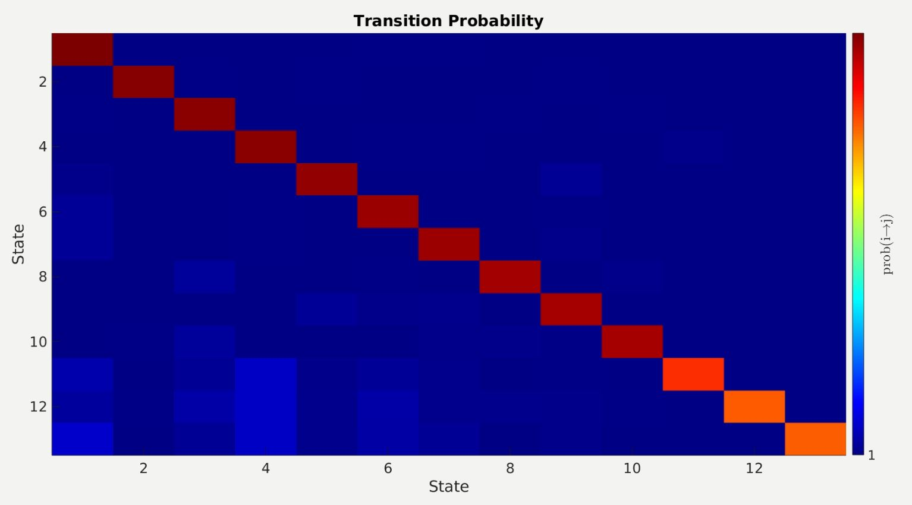
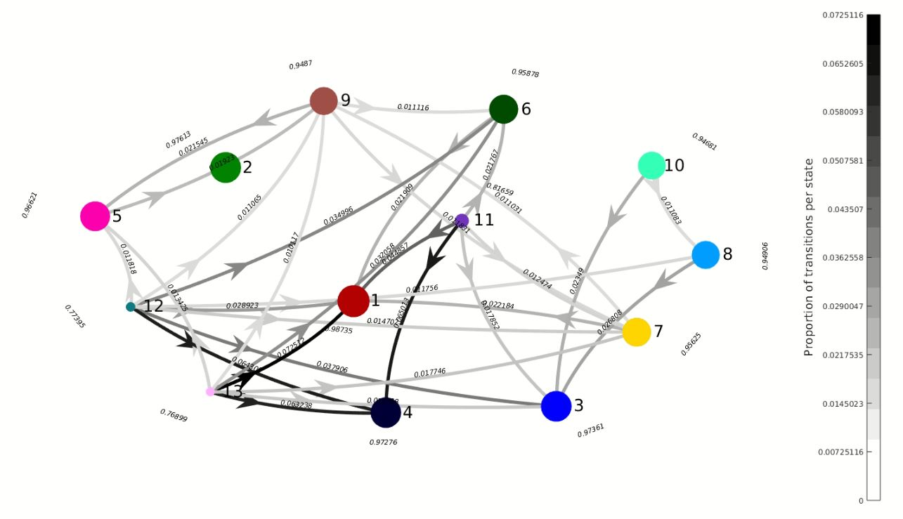

# HMM analysis
Dependencies: [Mazzulab scripts](https://github.com/mazzulab/contamineuro_2019_spiking_net) with some adaptations.

- ~~prepare_markov.m~~: Function created to test the analysis using a single study day. It preprocesses the data of a NREM bout and displays it. Continue the analysis running 'demo2_HMM_Simple.m'. __Discontinued__, rather use the "nontrial" versions. In this case, the "nontrial" tag refers to the original trial-based arrangement from the Mazzulab scripts which don't apply to our data.  

- ~~prepare_markov_nontrial.m~~: Generates the spikes and spikes_peak structs in the format needed for the hmm analysis. This includes all vehicle data, which is needed for training the HMM model.
  
- prepare_markov_nontrial_splitC3.m: Same as above but splits C3 in short and long.
  
- ~~veh_rgs_data_for_hmm.mat~~: Structure which contains all data needed for HMM analysis from Vehicle study days of the RGS14 project. Generated from 'prepare_markov_nontrial.m'. The C3 split in short and long was not performed for this data. 

- veh_data_hmm_c3split.mat: Same as above but splitting C3 in short and long. 
  
- ~~markov_studyday.m~~: Same as "prepare_markov_nontrial.m" but customized to used a pretrained HMM model on specific study days. Prerequisite for "state_characteristics.m".
  
- markov_studyday_splitC3.m: Same as above but adapted for the C3 split data. 

- state_characteristics.m: Generates plots comparing state total time, number of state bouts and state bout duration between different OS conditions. It generates data to be exported to excel and shared with Lisa.
  
- [compute_tpm.m](https://github.com/genzellab/RGS14_clusters/blob/main/Adrian/compute_tpm.m): As the name suggests, it computes the transition probability matrix and displays the network in a similar fashion as the [Poe paper](https://doi.org/10.1073/pnas.212342711).  

# Multiplets analysis 
- multiplet_count_table.m: Generates multiplet table with ripple counts for Lisa. It splits data per Object Space trials. Input: __veh_data_hmm_c3split_with_trials.mat__ generated from prepare_markov_nontrial_splitC3_with_trials.m. Output file: __multipletdata_v3_16022024.xlsx__
- doublets_types_proportion.m: Simple script. Visualizes percentage of ripple types participating in first, second, and third ripple in doubletes and triplets respectively. 
- prepare_markov_nontrial_splitC3_with_trials.m: Same as prepare_markov_nontrial_splitC3, but splitting data per trials. Needed for creating table from script above splitting counts per trial.
- doublets_lags.m: Computes lags between different ripple types. Generates normalized histograms and indicates entropy in bits.
# 2024 pre-defence scripts
- [x] new_figure_clusters.py`: Displays figure with the 4 clusters in the 3D PCA space.

- [x] new_figure_clusters_part3.py`: Displays subplot figure with the separate clusters and the combined clusters in the 3D PCA space.

- [x] new_figure_clusters_part3_rgs.py`: Displays subplot figure with the separate clusters and the combined clusters in the 3D PCA space for the RGS ripples

- [x] 3D_and_2D_clusterplots.py`: Displays separate cluster blobs in 3D space, plus their corresponding 2D projections. 

# 2025 (last year updates + revision)

- [x] `redoing_pca_figure.m`: Re-creates the original matlab figure with the 4 clusters in the 3D PCA space.

